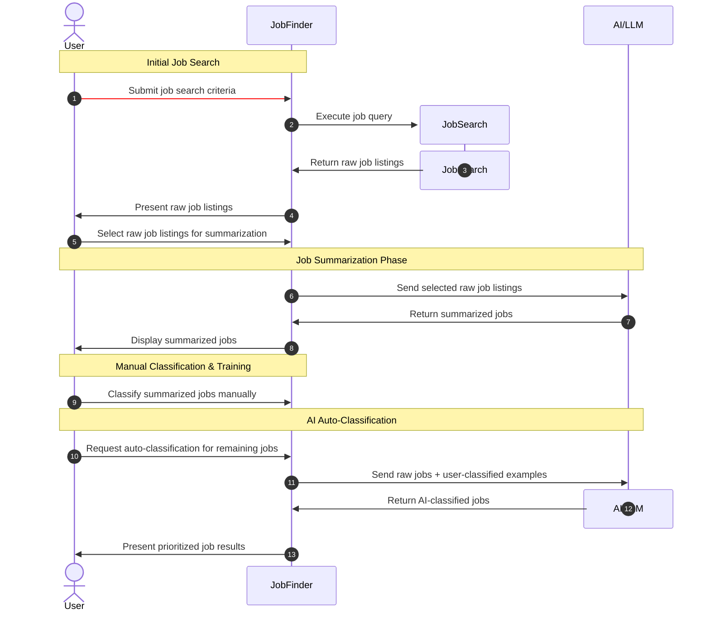

# jobfinder

A Streamlit-based job search application that scrapes and manages job listings using JobSpy, with AI-powered evaluation capabilities.

<!-- Pytest Coverage Comment:Begin -->
<a href="https://github.com/maxo99/jobfinder/blob/main/README.md"></a><details><summary>Coverage Report </summary><table><tr><th>File</th><th>Stmts</th><th>Miss</th><th>Cover</th><th>Missing</th></tr><tbody><tr><td colspan="5"><b>src/jobfinder</b></td></tr><tr><td>&nbsp; &nbsp;<a href="https://github.com/maxo99/jobfinder/blob/main/src/jobfinder/__init__.py">__init__.py</a></td><td>30</td><td>3</td><td>90%</td><td><a href="https://github.com/maxo99/jobfinder/blob/main/src/jobfinder/__init__.py#L13">13</a>, <a href="https://github.com/maxo99/jobfinder/blob/main/src/jobfinder/__init__.py#L41-L44">41&ndash;44</a></td></tr><tr><td>&nbsp; &nbsp;<a href="https://github.com/maxo99/jobfinder/blob/main/src/jobfinder/bootstrap.py">bootstrap.py</a></td><td>26</td><td>10</td><td>62%</td><td><a href="https://github.com/maxo99/jobfinder/blob/main/src/jobfinder/bootstrap.py#L23-L31">23&ndash;31</a>, <a href="https://github.com/maxo99/jobfinder/blob/main/src/jobfinder/bootstrap.py#L38">38</a></td></tr><tr><td>&nbsp; &nbsp;<a href="https://github.com/maxo99/jobfinder/blob/main/src/jobfinder/model.py">model.py</a></td><td>154</td><td>9</td><td>94%</td><td><a href="https://github.com/maxo99/jobfinder/blob/main/src/jobfinder/model.py#L93">93</a>, <a href="https://github.com/maxo99/jobfinder/blob/main/src/jobfinder/model.py#L122">122</a>, <a href="https://github.com/maxo99/jobfinder/blob/main/src/jobfinder/model.py#L130">130</a>, <a href="https://github.com/maxo99/jobfinder/blob/main/src/jobfinder/model.py#L132">132</a>, <a href="https://github.com/maxo99/jobfinder/blob/main/src/jobfinder/model.py#L154-L156">154&ndash;156</a>, <a href="https://github.com/maxo99/jobfinder/blob/main/src/jobfinder/model.py#L187">187</a>, <a href="https://github.com/maxo99/jobfinder/blob/main/src/jobfinder/model.py#L207">207</a></td></tr><tr><td>&nbsp; &nbsp;<a href="https://github.com/maxo99/jobfinder/blob/main/src/jobfinder/session.py">session.py</a></td><td>99</td><td>35</td><td>65%</td><td><a href="https://github.com/maxo99/jobfinder/blob/main/src/jobfinder/session.py#L48-L50">48&ndash;50</a>, <a href="https://github.com/maxo99/jobfinder/blob/main/src/jobfinder/session.py#L53-L56">53&ndash;56</a>, <a href="https://github.com/maxo99/jobfinder/blob/main/src/jobfinder/session.py#L59-L60">59&ndash;60</a>, <a href="https://github.com/maxo99/jobfinder/blob/main/src/jobfinder/session.py#L63-L66">63&ndash;66</a>, <a href="https://github.com/maxo99/jobfinder/blob/main/src/jobfinder/session.py#L73">73</a>, <a href="https://github.com/maxo99/jobfinder/blob/main/src/jobfinder/session.py#L87-L88">87&ndash;88</a>, <a href="https://github.com/maxo99/jobfinder/blob/main/src/jobfinder/session.py#L94">94</a>, <a href="https://github.com/maxo99/jobfinder/blob/main/src/jobfinder/session.py#L105">105</a>, <a href="https://github.com/maxo99/jobfinder/blob/main/src/jobfinder/session.py#L120-L122">120&ndash;122</a>, <a href="https://github.com/maxo99/jobfinder/blob/main/src/jobfinder/session.py#L126-L137">126&ndash;137</a>, <a href="https://github.com/maxo99/jobfinder/blob/main/src/jobfinder/session.py#L149">149</a>, <a href="https://github.com/maxo99/jobfinder/blob/main/src/jobfinder/session.py#L153">153</a>, <a href="https://github.com/maxo99/jobfinder/blob/main/src/jobfinder/session.py#L164-L167">164&ndash;167</a></td></tr><tr><td colspan="5"><b>src/jobfinder/adapters</b></td></tr><tr><td>&nbsp; &nbsp;<a href="https://github.com/maxo99/jobfinder/blob/main/src/jobfinder/adapters/chat_client.py">chat_client.py</a></td><td>23</td><td>12</td><td>48%</td><td><a href="https://github.com/maxo99/jobfinder/blob/main/src/jobfinder/adapters/chat_client.py#L16-L18">16&ndash;18</a>, <a href="https://github.com/maxo99/jobfinder/blob/main/src/jobfinder/adapters/chat_client.py#L24-L41">24&ndash;41</a></td></tr><tr><td>&nbsp; &nbsp;<a href="https://github.com/maxo99/jobfinder/blob/main/src/jobfinder/adapters/elasticsearch_client.py">elasticsearch_client.py</a></td><td>17</td><td>4</td><td>76%</td><td><a href="https://github.com/maxo99/jobfinder/blob/main/src/jobfinder/adapters/elasticsearch_client.py#L27">27</a>, <a href="https://github.com/maxo99/jobfinder/blob/main/src/jobfinder/adapters/elasticsearch_client.py#L39">39</a>, <a href="https://github.com/maxo99/jobfinder/blob/main/src/jobfinder/adapters/elasticsearch_client.py#L49">49</a>, <a href="https://github.com/maxo99/jobfinder/blob/main/src/jobfinder/adapters/elasticsearch_client.py#L59">59</a></td></tr><tr><td colspan="5"><b>src/jobfinder/services</b></td></tr><tr><td>&nbsp; &nbsp;<a href="https://github.com/maxo99/jobfinder/blob/main/src/jobfinder/services/scoring_service.py">scoring_service.py</a></td><td>39</td><td>30</td><td>23%</td><td><a href="https://github.com/maxo99/jobfinder/blob/main/src/jobfinder/services/scoring_service.py#L14-L48">14&ndash;48</a></td></tr><tr><td>&nbsp; &nbsp;<a href="https://github.com/maxo99/jobfinder/blob/main/src/jobfinder/services/summarization_service.py">summarization_service.py</a></td><td>29</td><td>18</td><td>38%</td><td><a href="https://github.com/maxo99/jobfinder/blob/main/src/jobfinder/services/summarization_service.py#L19-L45">19&ndash;45</a></td></tr><tr><td colspan="5"><b>src/jobfinder/utils</b></td></tr><tr><td>&nbsp; &nbsp;<a href="https://github.com/maxo99/jobfinder/blob/main/src/jobfinder/utils/__init__.py">__init__.py</a></td><td>7</td><td>1</td><td>86%</td><td><a href="https://github.com/maxo99/jobfinder/blob/main/src/jobfinder/utils/__init__.py#L8">8</a></td></tr><tr><td>&nbsp; &nbsp;<a href="https://github.com/maxo99/jobfinder/blob/main/src/jobfinder/utils/loader.py">loader.py</a></td><td>27</td><td>2</td><td>93%</td><td><a href="https://github.com/maxo99/jobfinder/blob/main/src/jobfinder/utils/loader.py#L20">20</a>, <a href="https://github.com/maxo99/jobfinder/blob/main/src/jobfinder/utils/loader.py#L33">33</a></td></tr><tr><td>&nbsp; &nbsp;<a href="https://github.com/maxo99/jobfinder/blob/main/src/jobfinder/utils/persistence.py">persistence.py</a></td><td>41</td><td>22</td><td>46%</td><td><a href="https://github.com/maxo99/jobfinder/blob/main/src/jobfinder/utils/persistence.py#L13-L17">13&ndash;17</a>, <a href="https://github.com/maxo99/jobfinder/blob/main/src/jobfinder/utils/persistence.py#L23-L39">23&ndash;39</a>, <a href="https://github.com/maxo99/jobfinder/blob/main/src/jobfinder/utils/persistence.py#L43-L44">43&ndash;44</a>, <a href="https://github.com/maxo99/jobfinder/blob/main/src/jobfinder/utils/persistence.py#L57-L59">57&ndash;59</a></td></tr><tr><td>&nbsp; &nbsp;<a href="https://github.com/maxo99/jobfinder/blob/main/src/jobfinder/utils/service_helpers.py">service_helpers.py</a></td><td>10</td><td>6</td><td>40%</td><td><a href="https://github.com/maxo99/jobfinder/blob/main/src/jobfinder/utils/service_helpers.py#L9-L14">9&ndash;14</a></td></tr><tr><td colspan="5"><b>src/jobfinder/views</b></td></tr><tr><td>&nbsp; &nbsp;<a href="https://github.com/maxo99/jobfinder/blob/main/src/jobfinder/views/add_record.py">add_record.py</a></td><td>29</td><td>12</td><td>59%</td><td><a href="https://github.com/maxo99/jobfinder/blob/main/src/jobfinder/views/add_record.py#L27-L56">27&ndash;56</a></td></tr><tr><td>&nbsp; &nbsp;<a href="https://github.com/maxo99/jobfinder/blob/main/src/jobfinder/views/data_management.py">data_management.py</a></td><td>41</td><td>14</td><td>66%</td><td><a href="https://github.com/maxo99/jobfinder/blob/main/src/jobfinder/views/data_management.py#L30-L31">30&ndash;31</a>, <a href="https://github.com/maxo99/jobfinder/blob/main/src/jobfinder/views/data_management.py#L41-L49">41&ndash;49</a>, <a href="https://github.com/maxo99/jobfinder/blob/main/src/jobfinder/views/data_management.py#L59-L62">59&ndash;62</a></td></tr><tr><td>&nbsp; &nbsp;<a href="https://github.com/maxo99/jobfinder/blob/main/src/jobfinder/views/display_filters.py">display_filters.py</a></td><td>24</td><td>10</td><td>58%</td><td><a href="https://github.com/maxo99/jobfinder/blob/main/src/jobfinder/views/display_filters.py#L28-L30">28&ndash;30</a>, <a href="https://github.com/maxo99/jobfinder/blob/main/src/jobfinder/views/display_filters.py#L37-L40">37&ndash;40</a>, <a href="https://github.com/maxo99/jobfinder/blob/main/src/jobfinder/views/display_filters.py#L45-L47">45&ndash;47</a></td></tr><tr><td>&nbsp; &nbsp;<a href="https://github.com/maxo99/jobfinder/blob/main/src/jobfinder/views/find_jobs.py">find_jobs.py</a></td><td>39</td><td>6</td><td>85%</td><td><a href="https://github.com/maxo99/jobfinder/blob/main/src/jobfinder/views/find_jobs.py#L45">45</a>, <a href="https://github.com/maxo99/jobfinder/blob/main/src/jobfinder/views/find_jobs.py#L77-L82">77&ndash;82</a></td></tr><tr><td>&nbsp; &nbsp;<a href="https://github.com/maxo99/jobfinder/blob/main/src/jobfinder/views/individual_job_details.py">individual_job_details.py</a></td><td>53</td><td>17</td><td>68%</td><td><a href="https://github.com/maxo99/jobfinder/blob/main/src/jobfinder/views/individual_job_details.py#L34">34</a>, <a href="https://github.com/maxo99/jobfinder/blob/main/src/jobfinder/views/individual_job_details.py#L70">70</a>, <a href="https://github.com/maxo99/jobfinder/blob/main/src/jobfinder/views/individual_job_details.py#L74">74</a>, <a href="https://github.com/maxo99/jobfinder/blob/main/src/jobfinder/views/individual_job_details.py#L80-L95">80&ndash;95</a>, <a href="https://github.com/maxo99/jobfinder/blob/main/src/jobfinder/views/individual_job_details.py#L99-L100">99&ndash;100</a>, <a href="https://github.com/maxo99/jobfinder/blob/main/src/jobfinder/views/individual_job_details.py#L104-L107">104&ndash;107</a>, <a href="https://github.com/maxo99/jobfinder/blob/main/src/jobfinder/views/individual_job_details.py#L111">111</a></td></tr><tr><td>&nbsp; &nbsp;<a href="https://github.com/maxo99/jobfinder/blob/main/src/jobfinder/views/listings_overview.py">listings_overview.py</a></td><td>24</td><td>2</td><td>92%</td><td><a href="https://github.com/maxo99/jobfinder/blob/main/src/jobfinder/views/listings_overview.py#L106-L107">106&ndash;107</a></td></tr><tr><td>&nbsp; &nbsp;<a href="https://github.com/maxo99/jobfinder/blob/main/src/jobfinder/views/scoring_util.py">scoring_util.py</a></td><td>43</td><td>11</td><td>74%</td><td><a href="https://github.com/maxo99/jobfinder/blob/main/src/jobfinder/views/scoring_util.py#L36">36</a>, <a href="https://github.com/maxo99/jobfinder/blob/main/src/jobfinder/views/scoring_util.py#L61-L63">61&ndash;63</a>, <a href="https://github.com/maxo99/jobfinder/blob/main/src/jobfinder/views/scoring_util.py#L70-L88">70&ndash;88</a></td></tr><tr><td>&nbsp; &nbsp;<a href="https://github.com/maxo99/jobfinder/blob/main/src/jobfinder/views/summarization_util.py">summarization_util.py</a></td><td>49</td><td>27</td><td>45%</td><td><a href="https://github.com/maxo99/jobfinder/blob/main/src/jobfinder/views/summarization_util.py#L44-L82">44&ndash;82</a></td></tr><tr><td><b>TOTAL</b></td><td><b>823</b></td><td><b>251</b></td><td><b>70%</b></td><td>&nbsp;</td></tr></tbody></table></details>
<!-- Pytest Coverage Comment:End -->


## Features

- **Job Scraping**: Automated job listing collection via JobSpy
- **Persistent Storage**: Results saved across multiple runs
- **User Scoring**: Manual evaluation and weighting of job listings
- **AI Evaluation**: Automated scoring using OpenAI chat completions
- **Modern Tooling**: Built with Streamlit, managed with uv

### Built with:
- [JobSpy](https://github.com/speedyapply/JobSpy) for job scraping
- [Streamlit](https://streamlit.io/) for the web interface
- [uv](https://docs.astral.sh/uv/) for package management
- [Jinja](https://jinja.palletsprojects.com/en/stable/) for templating
- [OpenAI](https://openai.com/) for AI-powered evaluation


## Walkthrough
###  User-Guided Phase
User actions are shown in the red sequnce flow (Upon system maturity these can be automated with higher confidence).

Generative responses are shown in the green sequence flow and should be reviewed by user until.

Upon system maturity, (user has confidence in the generative responses being returned), the red flow can be automated and reviewing of green flow can be done at discresion. 

#### Red (User Operation)
- (1) Setup initial job preferences for to configure Job Search tooling.
- (9) Use summarized jobs to efficiently provide classification of jobs using a score and pros/cons so that it may be used as context for AI tooling to classify larger quantities of job listings autonomously. 

#### Green (Generative Response)
- (8) Ensure that the summarization of job descriptions is relevant to qualifications and necessary details for efficient classification without needing to provide entire job descriptions in classification context. 



```

## Installation

```bash
# Clone the repository
git clone <repository-url>
cd jobfinder

# Install dependencies
uv add --editable --dev jobfinder
```

## Configuration

Create a `.env` file in the root directory:

```env
OPENAI_KEY=your_openai_api_key_here
OPENAI_MODEL=gpt-4  # or your preferred model
```

## Usage


## Development


### Configuration
- To add additional configurations, create .env in root of repository directory.
- To enable scoring using chat completions model, add to .env:
` OPENAI_KEY = {YOUR_KEY} `
- To set OpenAI chat completions model, add to .env:
` OPENAI_MODEL = {MODEL} `

### Running the Application
```bash
streamlit run main.py
```