# jobfinder

A Streamlit-based job search application that scrapes and manages job listings using JobSpy, with AI-powered evaluation capabilities.


## Features

- **Job Scraping**: Automated job listing collection via JobSpy
- **Persistent Storage**: Results saved across multiple runs
- **User Scoring**: Manual evaluation and weighting of job listings
- **AI Evaluation**: Automated scoring using OpenAI chat completions
- **Modern Tooling**: Built with Streamlit, managed with uv

### Built with:
- [JobSpy](https://github.com/speedyapply/JobSpy) for job scraping
- [Streamlit](https://streamlit.io/) for the web interface
- [uv](https://docs.astral.sh/uv/) for package management
- [Jinja](https://jinja.palletsprojects.com/en/stable/) for templating
- [OpenAI](https://openai.com/) for AI-powered evaluation


## Walkthrough
###  User-Guided Phase
User actions are shown in the red sequnce flow (Upon system maturity these can be automated with higher confidence).

Generative responses are shown in the green sequence flow and should be reviewed by user until.

Upon system maturity, (user has confidence in the generative responses being returned), the red flow can be automated and reviewing of green flow can be done at discresion. 

#### Red (User Operation)
- (1) Setup initial job preferences for to configure Job Search tooling.
- (9) Use summarized jobs to efficiently provide classification of jobs using a score and pros/cons so that it may be used as context for AI tooling to classify larger quantities of job listings autonomously. 

#### Green (Generative Response)
- (8) Ensure that the summarization of job descriptions is relevant to qualifications and necessary details for efficient classification without needing to provide entire job descriptions in classification context. 

```mermaid
sequenceDiagram
autonumber

%%{init:
{'themeCSS':
'.messageLine0:nth-of-type(1) { stroke: red; }; .messageText:nth-of-type(1) { fill: red; font-size: 20 !important;}; .messageLine0:nth-of-type(7) { stroke: green; }; .messageText:nth-of-type(13) { fill: green; font-size: 20 !important;}; .messageLine0:nth-of-type(8) { stroke: green; }; .messageText:nth-of-type(15) { fill: green; font-size: 20 !important;};  .messageLine0:nth-of-type(9) { stroke: Red; }; .messageText:nth-of-type(17) { fill: Red; font-size: 20 !important;};   .messageLine0:nth-of-type(12) { stroke: Green; }; .messageText:nth-of-type(23) { fill: Green; font-size: 20 !important;}; .messageLine0:nth-of-type(13) { stroke: Green; }; .messageText:nth-of-type(25) { fill: Green; font-size: 20 !important;}; '}
}%%

    actor U as User
    participant JF as JobFinder
    
    Note over U,JF: Initial Job Search
    U->>JF: Submit job search criteria
    
    create participant JS as JobSearch
    JF->>JS: Execute job query
    destroy JS
    JS->>JF: Return raw job listings
    
    JF->>U: Present raw job listings
    
    U->>JF: Select raw job listings for summarization
    
    create participant LLM as AI/LLM
    Note over U,LLM: Job Summarization Phase

    JF->>LLM: Send selected raw job listings
    LLM->>JF: Return summarized jobs
    JF->>U: Display summarized jobs
    
    Note over U,JF: Manual Classification & Training
    U->>JF: Classify summarized jobs manually
    
    Note over U,LLM: AI Auto-Classification
    U->>JF: Request auto-classification for remaining jobs
    JF->>LLM: Send raw jobs + user-classified examples
    destroy LLM
    LLM->>JF: Return AI-classified jobs

    
    JF->>U: Present prioritized job results


 

```



```

## Installation

```bash
# Clone the repository
git clone <repository-url>
cd jobfinder

# Install dependencies
uv add --editable --dev jobfinder
```

## Configuration

Create a `.env` file in the root directory:

```env
OPENAI_KEY=your_openai_api_key_here
OPENAI_MODEL=gpt-4  # or your preferred model
```

## Usage


## Development


### Configuration
- To add additional configurations, create .env in root of repository directory.
- To enable scoring using chat completions model, add to .env:
` OPENAI_KEY = {YOUR_KEY} `
- To set OpenAI chat completions model, add to .env:
` OPENAI_MODEL = {MODEL} `

### Running the Application
```bash
streamlit run main.py
```