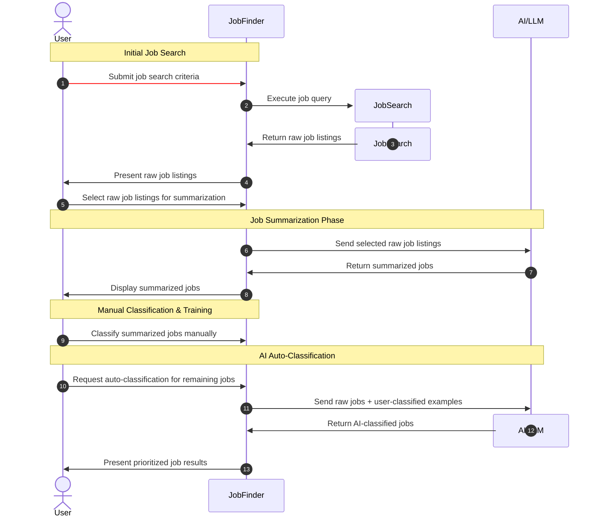
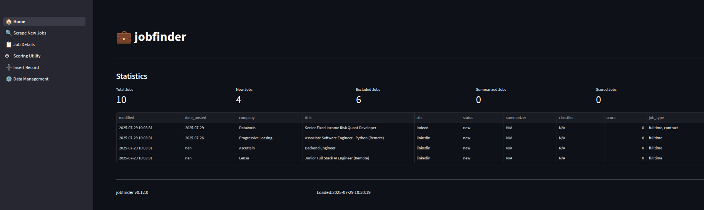
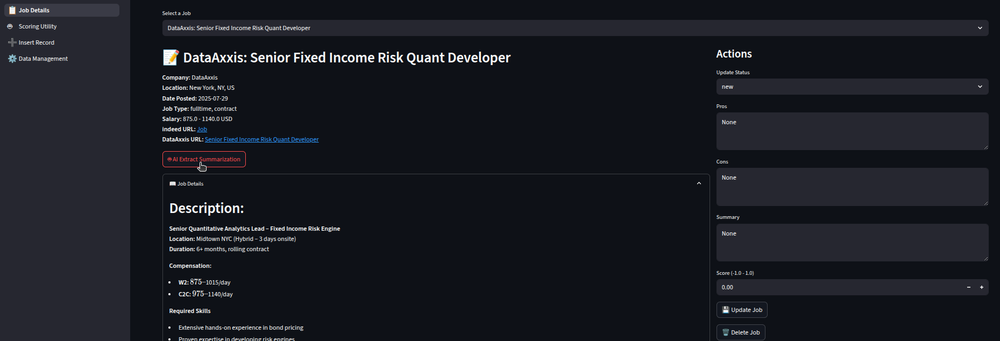
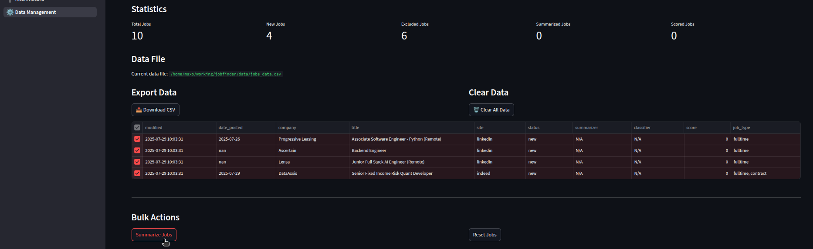
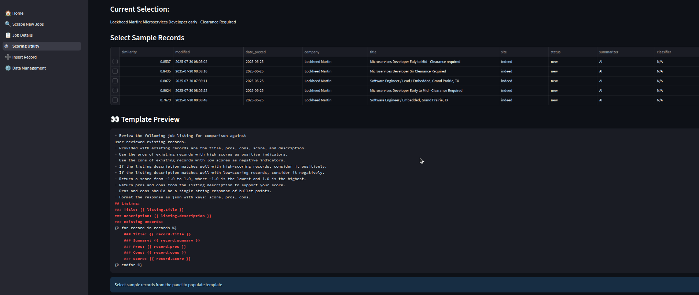
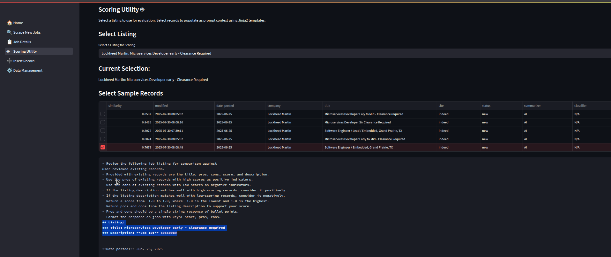

# JobFinder Walkthrough

*updates required to descriptions*

*Page documentation needs to be annonomized with images using test data*

## Data Sequence

#### User-Guided Phase

User actions are shown in the red sequnce flow (Upon system maturity these can be automated with higher confidence).

Generative responses are shown in the green sequence flow and should be reviewed by user until large enough corpus of data is available.

Upon system maturity, (user has confidence in the generative responses being returned), the red flow can be automated and reviewing of green flow can be done at discresion.

#### Red (User Operation)

- (1) Setup initial job preferences for to configure Job Search tooling.
- (9) Use summarized jobs to efficiently provide classification of jobs using a score and pros/cons so that it may be used as context for AI tooling to classify larger quantities of job listings autonomously.

#### Green (Generative Response)

- (8) Ensure that the summarization of job descriptions is relevant to qualifications and necessary details for efficient classification without needing to provide entire job descriptions in classification context.

## Walkthrough Pages

### Records Display

### AI Extraction of Summarization

### Bulk Summarization of Jobs

### Review Jinja2 Template

### Populated Template from selections

